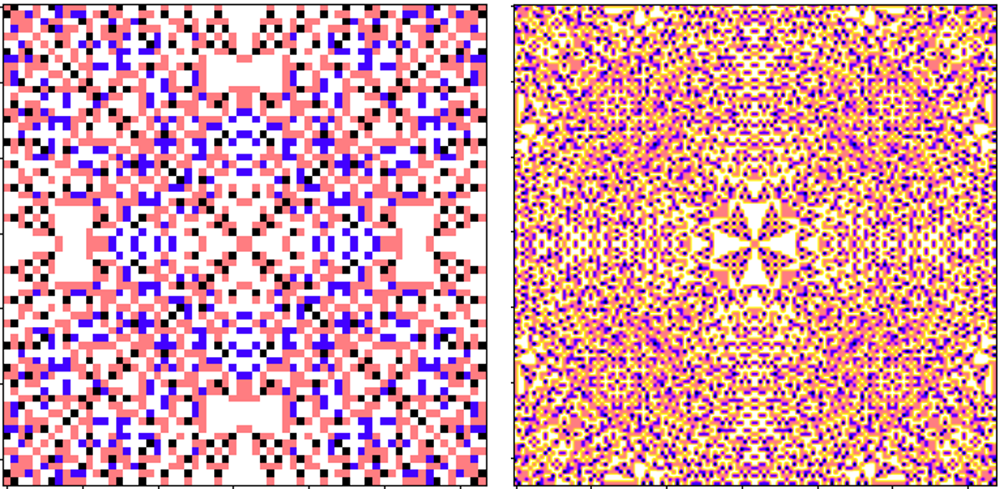

## Cellular Automata: Abelian-Sandpile and generalised Game of Life

Implementation of generalirsed cellular automata models using NumPy containers for optimised run times, avoiding nested for loops where possible.

Fig.  Sandpile converged state for a 128x128 array with initial state equal to 48 for each cell.

### Functions included in the automata class:

-Abelian Sandpile
=Game of Life (triangular mesh)
-Game of Life (generic rules)
-Game of Life (generic n-dimensional mesh/connectivity graph)

### Requirements

